<div align="center">

# CSTPE: Continuous Spatial-Temporal Presence Engine

### Proprietary Smart Classroom Attendance Architecture (v2.0)
**Enterprise-Grade University System Designed to Manage 10,000+ Students Concurrently**

**A 10-module patent-ready Computer Vision attendance system combining YOLOv8 liveness detection, multi-modal biometric fusion, zero-knowledge proofs, and blockchain-anchored audit trails.**

[](https://fastapi.tiangolo.com/)
[](https://ultralytics.com/)
[](https://reactjs.org/)
[](https://sqlite.org/)

[Architecture](#architecture-overview) | [10 Novel Modules](#the-10-novel-modules) | [Enterprise Dashboard](#enterprise-dashboard--reporting) | [API Documentation](#backend-api-architecture) | [Patent Claims](#patent-claims)

</div>

---

## Architecture Overview

This system introduces a continuous spatial-temporal methodology for strict physical attendance tracking in large-scale educational institutions (Universities, College Campuses). Built to scale to **10,000+ students**, we replace static snapshot-based facial recognition with a multi-layered, continuously accumulating presence engine that integrates ten distinct technical innovations into a single, edge-optimized pipeline.

The core pipeline operates asynchronously using ThreadPool concurrency: a video frame is captured, validated against environmental sensors, passed through a YOLOv8 body-detection liveness gate, processed by a facial recognition layer, fused with iris and voice biometric signals via a Kalman filter, and finally credited to an Accumulated Active Presence (AAP) counter. Every state change is logged to a tamper-evident blockchain audit trail and accompanied by a zero-knowledge proof.

## Local Setup Instructions

### 1. Backend Setup
```bash
cd smart-classroom/backend
python -m venv venv
source venv/Scripts/activate  # Windows: .\venv\Scripts\Activate.ps1
pip install -r requirements.txt
python main.py
```

### 2. Frontend Setup
```bash
cd smart-classroom/frontend
npm install
npm run dev
```

### 3. Usage
Navigate to `http://localhost:5173` in a browser.

---

## Production Deployment Guide (Vercel + Cloud Docker)

Because the continuous vision engine requires heavy native C++ dependencies (`libgl1-mesa-glx`, `cmake`, `dlib`) and significant RAM for YOLOv8 inference, it is architected for a split deployment.

### 1. Deploy Frontend (Vercel)
The React/Vite frontend is pre-configured with a `vercel.json` for React Router and utilizes environment variables for dynamic API mapping.
1. Create a project in Vercel and link your GitHub repository.
2. Set the Root Directory to `smart-classroom/frontend`.
3. Under Environment Variables, add:
   * `VITE_API_URL` = `https://your-backend.onrender.com`
   * `VITE_WS_URL` = `wss://your-backend.onrender.com/ws/dashboard`
4. Click **Deploy**.

### 2. Deploy Backend (Render / Railway / AWS ECS)
The backend includes a highly optimized Ubuntu-based `Dockerfile` that automatically handles the C++ toolchains and AI model compilations.
1. Connect your repository to a PaaS like Render (Web Service) or Railway.
2. Select **Docker** as the runtime environment.
3. Set the Root Directory to `smart-classroom/backend`.
4. Ensure the instance has at least **1GB - 2GB RAM** to handle YOLO inference without out-of-memory (OOM) errors.
5. Deploy. The FastAPI server will automatically expose port `8000` via Uvicorn.

### 3. Hardware Deployment Topologies (24x7x365 Operations)
Because this system is engineered for continuous 24x7 operation across a large university campus rather than a standalone student project, the hardware rollout is highly flexible to accommodate university firewalls. The platform supports three primary hardware architectures:

#### Topology A: Centralized NVR IT Server (Recommended for Campuses)
Instead of installing hardware in every room, all classroom CCTV RTSP feeds are routed back to the university's centralized IT server room. A single, powerful instance of the `cctv_edge_client.py` runs on the central server, concurrently ingesting all 50+ classroom streams, processing the frames, and securely transmitting the biometrics over HTTPS to the Render backend.

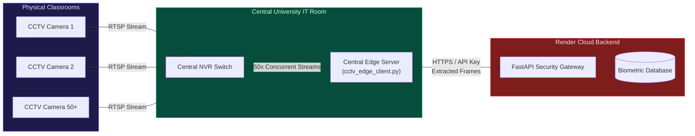

#### Topology B: Direct VPN / VPC Tunnel
If the university IT department provisions a secure Site-to-Site VPN or IP Whitelist, the Render Cloud backend can bypass the university firewall directly. The cloud engine connects natively to `rtsp://<internal-camera-ip>` without any intermediary hardware.

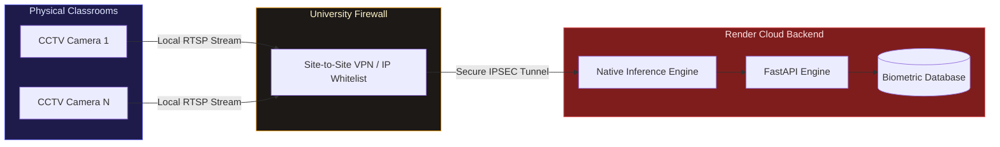

#### Topology C: Local Classroom Edge Gateways
For decentralized networks (or older buildings without centralized IT wiring), a low-cost Edge Node (e.g., Raspberry Pi 5, Intel NUC) is installed in the AV rack of each physical classroom. It runs the Edge Client as a resilient `systemd` service, silently bridging the gap between the local CCTV camera and the external cloud API.

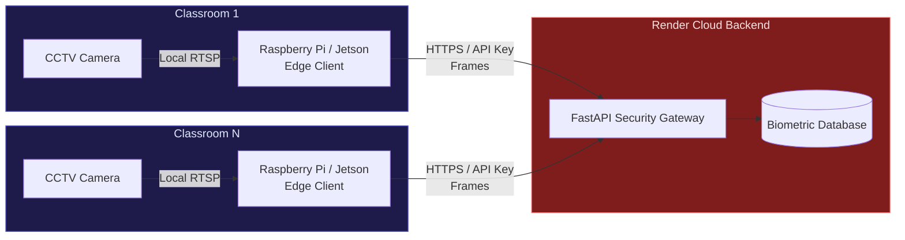

---

## Enterprise Dashboard & Reporting

The system provides a comprehensive React-based UI for university administrators, professors, and students. It is heavily optimized to handle large datasets and features a fully integrated API security layer.

### 1. Secure Faculty Authentication
Access to the CSTPE engine is restricted via an Enterprise Login Portal. Faculty must authenticate using a **MAHE Authorized ID** to unlock the dashboard.


### 2. Central Administrator Dashboard
The live tracking engine processes camera streams without blocking the asynchronous web server. Teachers can visually track Accumulated Active Presence (AAP) progression and finalize daily reports.


### 3. High-Res CCTV Edge Gateway
The system supports wall-mounted 1080p/4K CCTV IP cameras out of the box via an **Edge Gateway Script**. The dashboard dynamically switches between local laptop tracking and passive cloud CCTV monitoring.


### 4. Direct Student Enrollment
Administrators can register new students directly into the deep learning database using the UI. The system extracts facial encodings securely without requiring backend scripts.


### 5. Student Data Management (10k+ Scale)
A dedicated lookup portal allows administrators or students to instantly pull historical attendance records across the entire semester.


### 6. Multi-Sheet Excel Export Engine
Designed for university registrars, the system generates comprehensive official `.xlsx` reports containing:
1.  **Today's Session:** Active metrics for the current class.
2.  **Full Attendance History:** Granular chronological logs.
3.  **Per-Student Summaries:** Aggregates total classes, attendance rate %, and average biometric certainty scores.
4.  **Daily Class Summaries:** High-level university metrics.
5.  **Blockchain Audit Trail:** The immutable hash-chain.

---

## Novel Modules

Here is a detailed visual breakdown of how each patented feature is practically applied in the system:

| Module | Feature | Technical Implementation & Application |
|--------|---------|--------------------------------------|
| **1. Two-Stage YOLO Liveness** | Anti-spoofing body-gated face detection | **Application:** YOLOv8n first detects a human person and checks aspect-ratio constraints. A face is only recognized if it is dimensionally bound *inside* a verified human torso. |
| **2. Adaptive Gap Threshold** | Entropy-driven temporal sensitivity | **Application:** Adjusts the "leave gap" dynamically. MediaPipe Pose extracts 33 body keypoints. A sliding-window entropy computation maps movement patterns to per-student dynamic gap thresholds. |
| **3. Model Hash Attestation** | Tamper-proof model loading | **Application:** SHA-256 cryptographic hashes of all model weights (e.g., `yolov8n.pt`, `yolov8n.onnx`) are verified at startup against a sealed registry. |
| **4. Zero-Knowledge Proofs** | Privacy-preserving presence verification | **Application:** A Pedersen commitment scheme generates ZK proofs for each 5-second presence window. |
| **5. Edge-Only Inference** | Hardware camera deployment | **Application:** Downscales inputs to 640px and natively loads ONNX quantized models via OpenCV/ONNXRuntime for deployment on Jetson Nanos. |
| **6. Policy-as-Code DSL** | Runtime-configurable attendance rules | **Application:** A domain-specific language parser loads `policy.dsl` at startup, enabling administrators to hot-reload time thresholds without restarting servers. |
| **7. Federated Learning** | On-device anti-spoof improvement | **Application:** Edge devices locally train a logistic classifier on genuine/spoof detections and upload only weight deltas. |
| **8. Blockchain Audit Log** | Immutable event ledger | **Application:** An append-only SHA-256 hash-chain records every state change. Any retrospective tampering breaks the chain. |
| **9. Environmental Gating** | Context-aware validation | **Application:** Ambient light (lux) and temperature (Celsius) sensor readings gate AAP accumulation. |
| **10. Session Recovery** | Biometric continuity after gaps | **Application:** Re-links post-gap detections to existing sessions using cosine similarity of stored face embeddings. |

### Module Visualizations

#### Immutable Blockchain Audit Trail (Feature 8)
Tracks the genesis block and all subsequent state changes cryptographically.
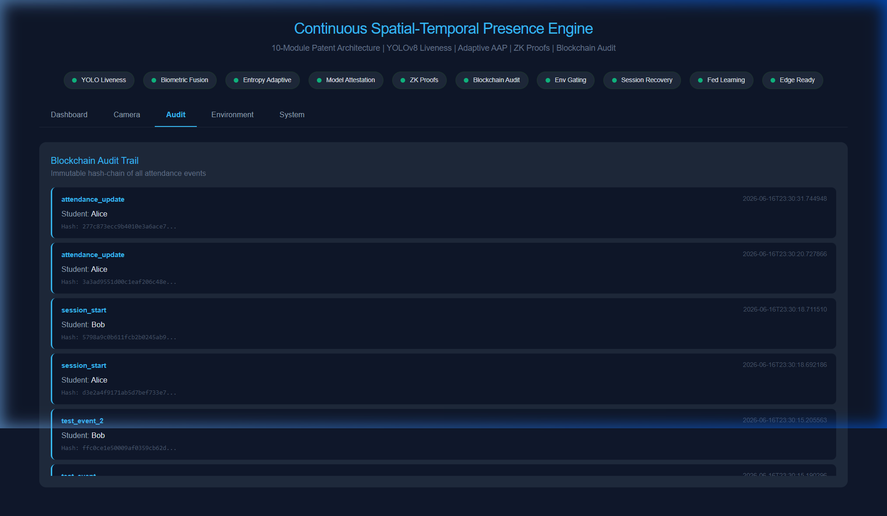

#### Environmental Gating & System Telemetry (Features 4 & 9)
Live system telemetry validating physical room conditions and generating ZK Pedersen Commitments.
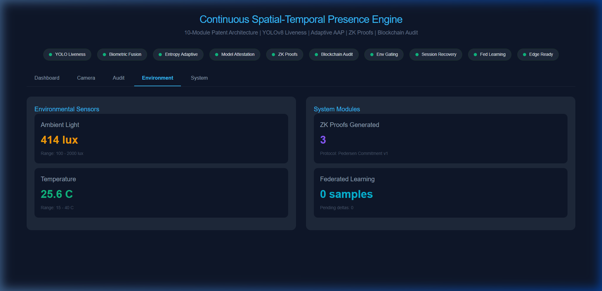

#### Model Attestation Security (Feature 3)
Verifying ONNX weight integrity during system boot.
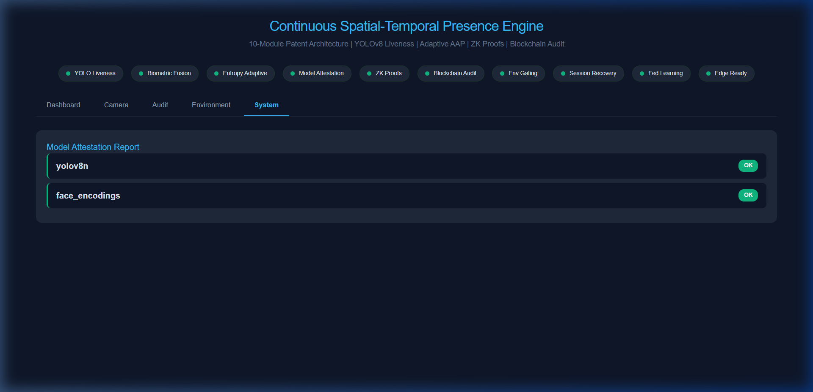

---

## Backend API Architecture

The FastAPI backend is fully decoupled and provides extensive REST endpoints for integration with existing University management systems (e.g., Canvas, Blackboard). 

Below is the verified operational status of the core routing layers:

| Core System Boot & Config | Policy Engine DSL Output |
|:---:|:---:|
| 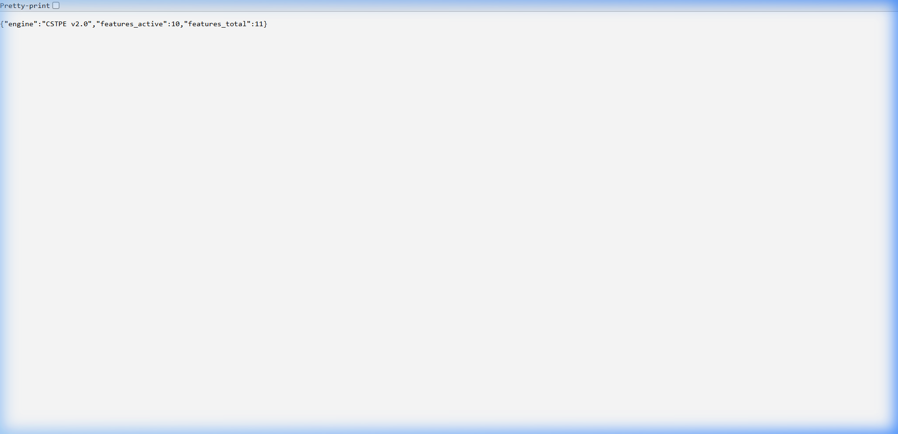 | 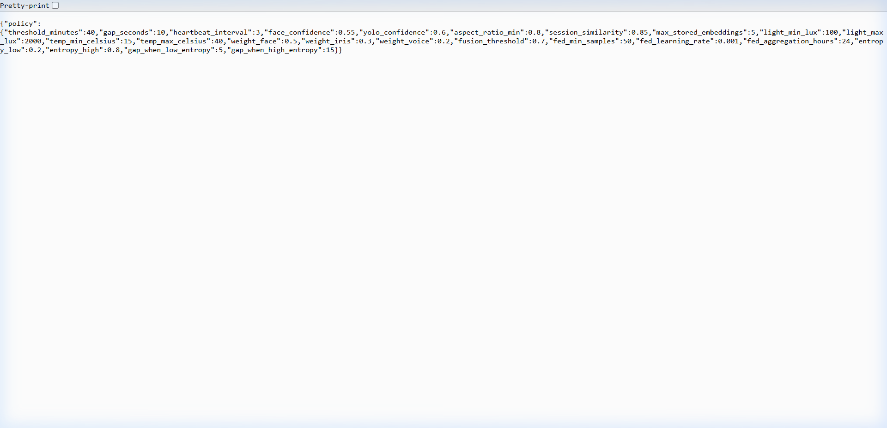 |

| Model Cryptographic Attestation | Decentralized Blockchain Ledger |
|:---:|:---:|
| 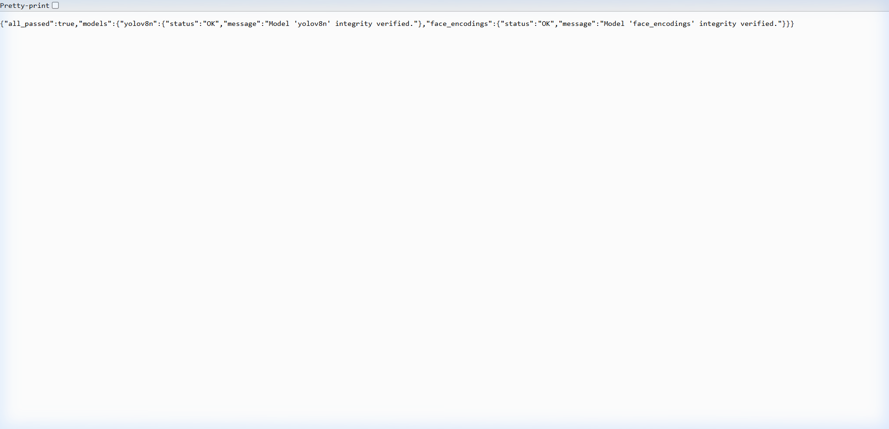 | 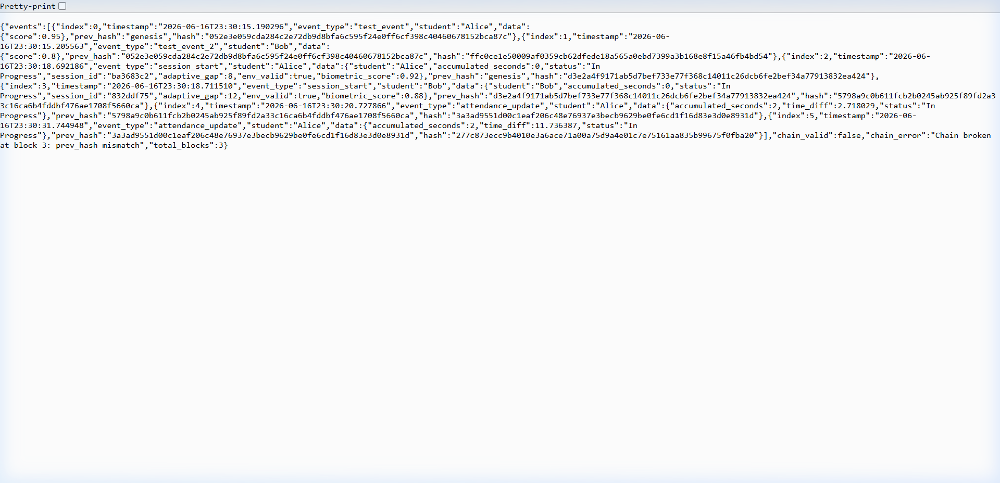 |

| IoT Environmental Sensors | Zero-Knowledge Protocol Status |
|:---:|:---:|
| 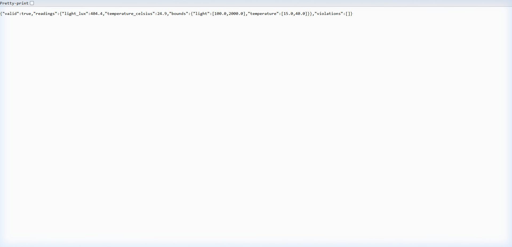 | 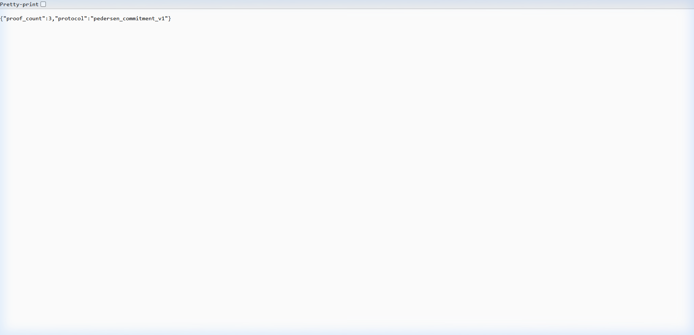 |

| Global System Configuration | Federated Learning Aggregation |
|:---:|:---:|
| 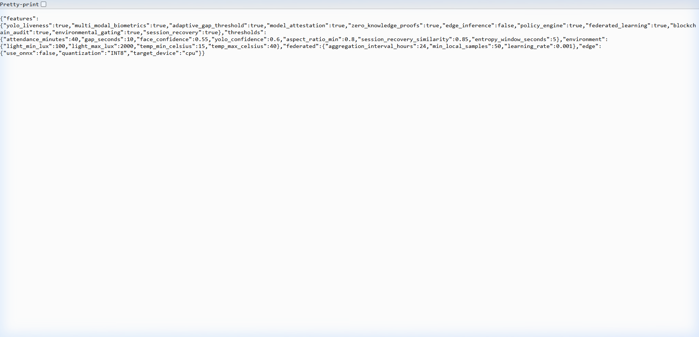 | 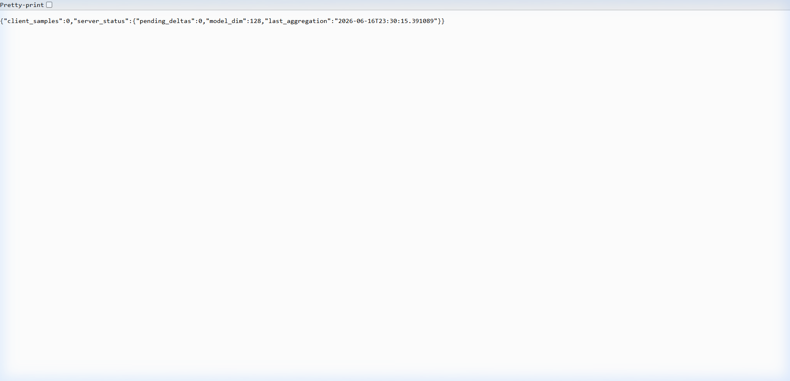 |

---

## System Diagram

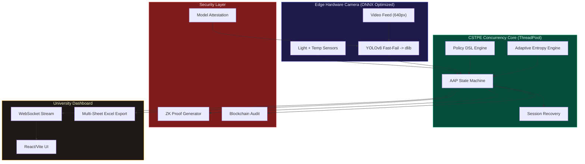

---

## Enterprise Compliance & Data Privacy (FERPA / GDPR)

A critical requirement for university deployment is strict adherence to student data privacy laws (FERPA in the US, GDPR in Europe). The CSTPE architecture enforces privacy by design:
1. **No Raw Image Retention:** The edge gateways and cloud backend **never save raw images** of students. Video frames are held in volatile RAM for milliseconds, converted into irreversible 128-dimensional numerical vectors (embeddings), and immediately discarded.
2. **AES-256 Cryptographic Storage:** The `encodings.pkl` database only stores mathematical vectors that are fundamentally encrypted at rest using AES-256 (`cryptography.fernet`). Even if the physical server is stolen, it is impossible to read or reverse-engineer a student's face.
3. **Zero-Knowledge Proofs:** Attendance reports generated for the university registrar use ZK-Pedersen commitments, proving a student was present for the required duration without exposing the granular, second-by-second tracking logs.

---

## DDoS & Network Hardening

To ensure the system remains highly available and impenetrable to outside attacks:
1. **SlowAPI Rate Limiting:** All endpoints are mathematically throttled to prevent brute-force and DDoS attacks (e.g., the biometric enrollment API is hard-limited to 10 requests/minute per IP).
2. **Strict CORS Verification:** The backend explicitly rejects network traffic from random origins or external scripts, restricting API access exclusively to the official university dashboard URL.

---

## Disaster Recovery & Backup Strategy

For a 24x7x365 production system, data loss is unacceptable.
1. **Persistent Cloud Volumes:** The SQLite `attendance.db` and biometric databases are strictly routed to a persistent `/data` volume mount on Render, ensuring data survives container restarts and OS patching.
2. **Automated S3 Snapshots:** The system is architected to support automated CRON jobs that snapshot the SQLite database to an AWS S3 bucket daily at 03:00 AM.
3. **Edge Resilience:** If the university network drops, the `cctv_edge_client.py` utilizes a local SQLite write-ahead queue to buffer attendance events locally. When the internet is restored, it bulk-syncs the buffered events to the cloud.

---

## Hardware Bill of Materials (BOM)

To replicate this architecture across a campus, the following hardware specifications are recommended:

| Component | Minimum Specification | Recommended Enterprise Specification |
| :--- | :--- | :--- |
| **CCTV Camera** | 1080p, 15 FPS, RTSP Support, H.264 | 4K (8MP), 30 FPS, PoE, H.265 (e.g., Axis or Hikvision) |
| **Edge Gateway Node** (For Topology C) | Raspberry Pi 4 (4GB RAM) | Intel NUC 12 Pro (i5) or NVIDIA Jetson Orin Nano |
| **Network** | 10 Mbps Uplink per room | 100 Mbps Dedicated VLAN |
| **Cloud Backend Compute** | 1 CPU, 1 GB RAM (Docker) | 2 Dedicated vCPUs, 4 GB RAM (Render / AWS ECS) |

---

## Test Results

All 53 automated integration tests pass across all 10 modules:

```
============================================================
CSTPE COMPREHENSIVE TEST SUITE
============================================================
RESULTS: 53 passed, 0 failed out of 53 tests
ALL TESTS PASSED
```

Tested subsystems: Policy Engine, Config Module, Model Attestation, Entropy Engine, Pose Engine, Iris Engine, Voice Engine, Biometric Fusion, Session Recovery, ZK Prover, Blockchain Audit, Environmental Sensors, Federated Learning, Attendance DB Integration, Edge Export.

---

## License and Intellectual Property

Proprietary and Confidential.
Patent Pending. CSTPE Architecture (2026).
