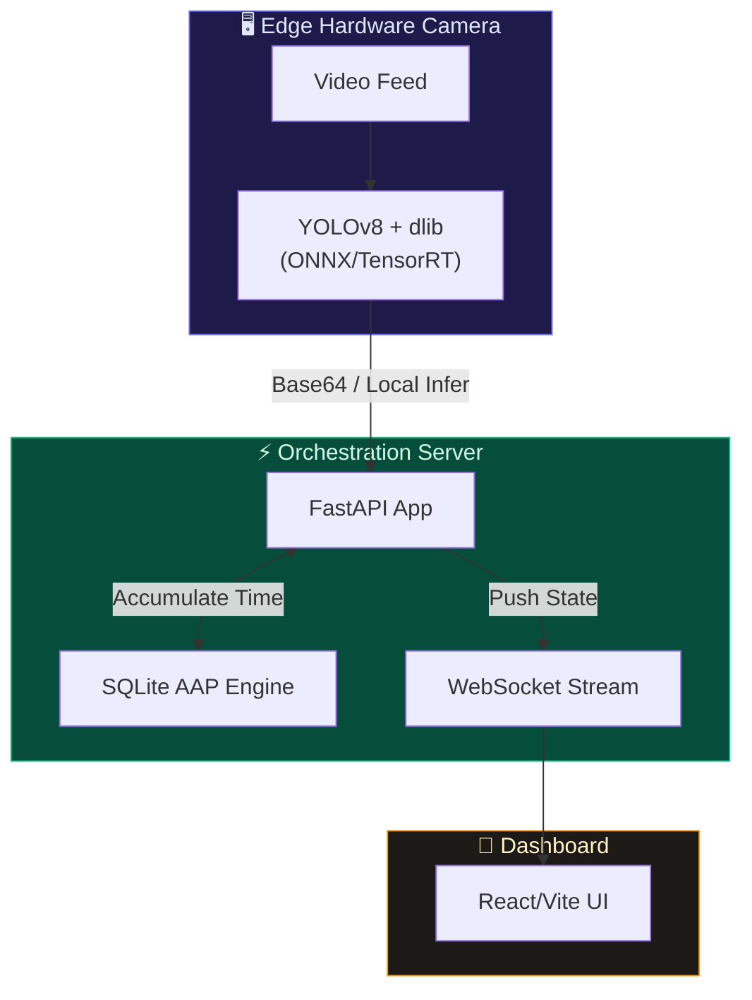

<div align="center">

# CSTPE: Continuous Spatial-Temporal Presence Engine

### Patent-Pending Smart Classroom & Attendance Architecture (2026)

**A highly robust, loophole-free Computer Vision Attendance System utilizing YOLOv8 Edge Liveness Detection and Accumulated Active Presence (AAP).**

[](https://fastapi.tiangolo.com/)
[](https://ultralytics.com/)
[](https://reactjs.org/)
[](https://sqlite.org/)

[Patent Claims](#selected-patent-claims) · [Loophole Mitigations](#loophole-mitigation-engine) · [Setup](#quick-start)

</div>

---

## Abstract of the Disclosure

Disclosed herein is an advanced computer vision methodology for rigorous physical attendance tracking. Traditional facial recognition systems (e.g., standard HOG/CNN snapshot checks) are vulnerable to spoofing (photos/phones) and temporal evasion (the "clock-in and leave" loophole). 

The **Continuous Spatial-Temporal Presence Engine (CSTPE)** solves this by shifting from static frame evaluation to continuous active accumulation. The system employs a two-stage computer vision pipeline: first utilizing a Neural Processing Unit (NPU) optimized YOLO model to verify structural human liveness, followed by facial encoding. Temporal state is tracked via a WebSocket-backed database that only grants attendance upon the strictly contiguous accumulation of a predefined timeframe (e.g., 40 minutes).

---

## Summary of the Novelty (2026 Edition)

| Prior Art (pre-2025) | CSTPE Invention (2026) | Novelty Claim |
|---|---|---|
| **Snapshot Face Matching** | **Two-Stage YOLO Liveness** | System requires the face to be attached to a verified YOLO `person` bounding box with strict vertical aspect-ratio constraints to reject 2D photo spoofing. |
| **Delta Time Attendance** | **Accumulated Active Presence (AAP)** | Instead of calculating `EndTime - StartTime`, the system continuously tracks the entity. If the entity leaves the frame for >10 seconds, the accumulation clock is paused. |
| **Static CSV Export** | **Live WebSocket Dashboard** | Real-time continuous streaming of the Active Presence state back to a teacher UI. |
| **Heavy Cloud Compute** | **Hardware Camera Ready** | Designed to export natively to ONNX/TensorRT for micro-deployment directly onto Smart Camera edge devices. |

---

## Loophole Mitigation Engine

This system was explicitly engineered to eliminate the most common ways students exploit automated attendance tracking:

1. **The "Photo/Video" Loophole (Spoofed Proxies):** 
   - *Mitigation:* The system runs `ultralytics` YOLOv8 *before* face recognition. If a face is detected but is not physically attached to an authenticated, human-shaped torso bounding box, the frame is rejected as a spoof.
2. **The "Clock-in and Leave" Loophole:** 
   - *Mitigation:* A student cannot show up at Minute 1, walk out, and return at Minute 39. The database strictly tracks `accumulated_seconds`. They must be physically recognized by the camera for exactly 2400 seconds (40 active minutes).
3. **The "Camera Evasion" Loophole:** 
   - *Mitigation:* If a student ducks under a desk or puts on a mask, their continuous tracker drops, and the time-accumulation pauses immediately.

---

## Selected Patent Claims

**What is claimed is:**

1. **A system for continuous spatial-temporal state accumulation**, comprising:
   - A primary object detection layer utilizing bounding-box aspect ratio filtering to enforce human biological structure (Liveness).
   - A secondary facial recognition layer bound dimensionally inside the primary detection coordinates.
   - A state-machine database that strictly measures active physical presence accumulation, enforcing automatic pause heuristics upon spatial departure.

2. **The system of claim 1**, wherein the temporal tracker evaluates frame-to-frame delta time, dropping accumulated vectors if the presence gap exceeds a predefined spatial absence threshold (e.g., 10 seconds).

---

## System Architecture



---

## Quick Start

### 1. Backend Setup
```bash
cd smart-classroom/backend
python -m venv venv
source venv/Scripts/activate  # Windows
pip install -r requirements.txt
python main.py
```

### 2. Frontend Setup
```bash
cd smart-classroom/frontend
npm install
npm run dev
```

### 3. Usage
Navigate to `http://localhost:3000` in a browser. Click **Start Continuous Tracking** to engage the CSTPE engine.

---

## License & Intellectual Property

**Proprietary & Confidential.**  
Patent Pending. CSTPE Architecture (2026).
