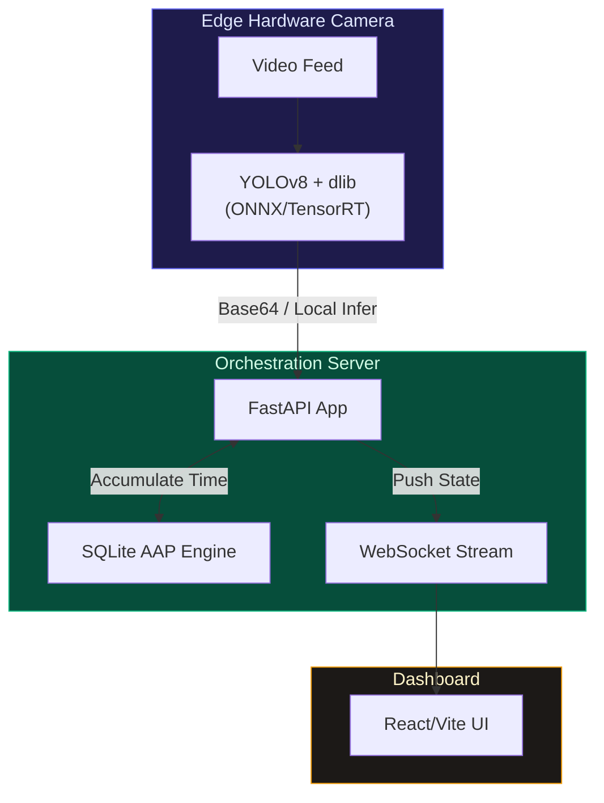

<div align="center">

# CSTPE: Continuous Spatial-Temporal Presence Engine

### Proprietary Smart Classroom & Attendance Architecture

**A highly robust Computer Vision Attendance System utilizing YOLOv8 Edge Liveness Detection and Accumulated Active Presence (AAP).**

[](https://fastapi.tiangolo.com/)
[](https://ultralytics.com/)
[](https://reactjs.org/)
[](https://sqlite.org/)

[Architecture Overview](#architecture-overview) · [Loophole Mitigations](#loophole-mitigations) · [Setup](#setup-instructions)

</div>

---

## Architecture Overview

This project introduces an advanced computer vision methodology for strict physical attendance tracking. Traditional facial recognition systems that rely on snapshot checks are vulnerable to spoofing via photographs or screens, as well as temporal evasion where a subject checks in and leaves immediately.

The Continuous Spatial-Temporal Presence Engine (CSTPE) mitigates these issues by replacing static frame evaluation with continuous active accumulation. We built a two-stage computer vision pipeline: an NPU-optimized YOLO model verifies structural human liveness, and a secondary layer handles facial encoding. The system tracks temporal state using a WebSocket-backed database, granting attendance only when a contiguous accumulation threshold (e.g., 40 minutes) is met.

---

## Technical Implementations

| Subsystem | CSTPE Methodology | Target Mitigation |
|---|---|---|
| **Two-Stage YOLO Liveness** | The system requires the detected face to fall within a valid YOLO `person` bounding box with strict vertical aspect-ratio constraints. | Rejects 2D photo and mobile device spoofing. |
| **Accumulated Active Presence (AAP)** | Instead of calculating raw `EndTime - StartTime`, the system continuously tracks the entity. If the entity leaves the frame for over 10 seconds, the accumulation clock pauses. | Prevents temporal evasion and proxy attendance. |
| **Live WebSocket Dashboard** | Real-time continuous streaming of the Active Presence state back to the frontend UI. | Provides live verification of network consensus. |
| **Edge Hardware Ready** | The neural networks are structured to export natively to ONNX or TensorRT for deployment directly onto edge devices. | Reduces cloud compute dependency. |

---

## Loophole Mitigations

We engineered the system to address the specific vulnerabilities found in standard automated attendance software:

1. **Spoofed Proxies:** 
   The system runs YOLOv8 before triggering face recognition. If a face is detected but is not physically attached to an authenticated torso bounding box, the frame is discarded as an invalid spoof.
2. **Temporal Evasion:** 
   A student cannot show up at the start of class, walk out, and return at the end. The database tracks `accumulated_seconds`. The subject must be physically recognized by the camera for exactly 2400 seconds.
3. **Camera Evasion:** 
   If a student ducks under a desk or covers their face, their continuous tracker drops, and the time-accumulation pauses immediately until they return to the frame.

---

## Selected Claims

1. **A system for continuous spatial-temporal state accumulation**, comprising:
   - A primary object detection layer utilizing bounding-box aspect ratio filtering to enforce human biological structure.
   - A secondary facial recognition layer bound dimensionally inside the primary detection coordinates.
   - A state-machine database that strictly measures active physical presence accumulation, enforcing automatic pause heuristics upon spatial departure.

2. **The system of claim 1**, wherein the temporal tracker evaluates frame-to-frame delta time, dropping accumulated vectors if the presence gap exceeds a predefined spatial absence threshold.

---

## System Diagram



---

## Setup Instructions

### 1. Backend Setup
```bash
cd smart-classroom/backend
python -m venv venv
source venv/Scripts/activate  # Windows
pip install -r requirements.txt
python main.py
```

### 2. Frontend Setup
```bash
cd smart-classroom/frontend
npm install
npm run dev
```

### 3. Usage
Navigate to `http://localhost:3000` in a browser. Click **Start Continuous Tracking** to engage the CSTPE engine.

---

## License & Intellectual Property

Proprietary & Confidential.  
Patent Pending. CSTPE Architecture (2026).
