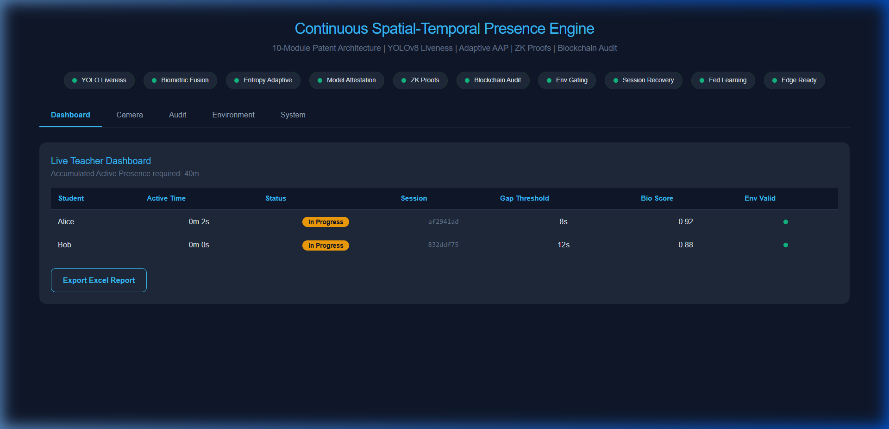
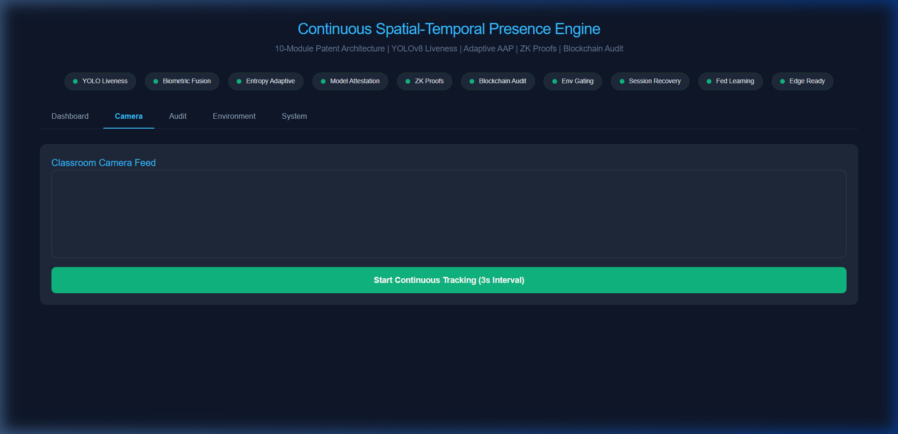
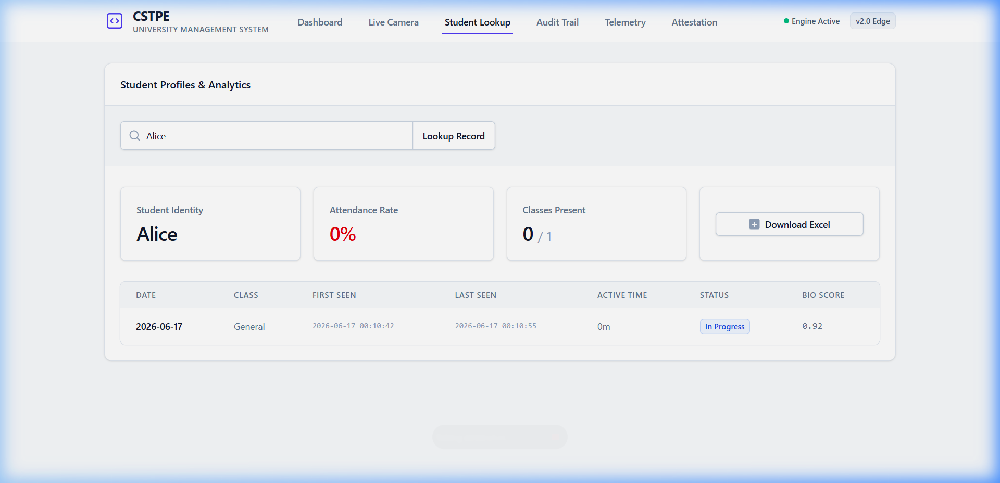
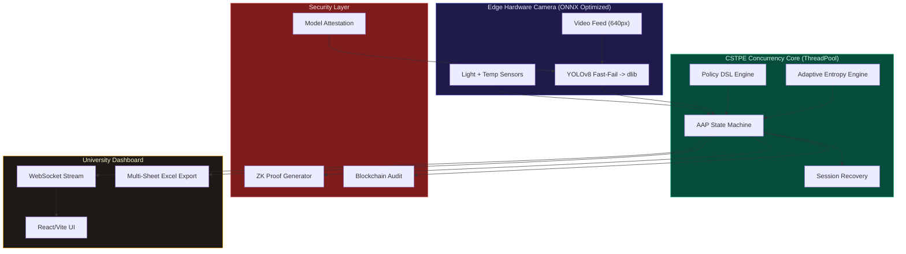

<div align="center">

# CSTPE: Continuous Spatial-Temporal Presence Engine

### Proprietary Smart Classroom Attendance Architecture (v2.0)
**Enterprise-Grade University System Designed to Manage 10,000+ Students Concurrently**

**A 10-module patent-ready Computer Vision attendance system combining YOLOv8 liveness detection, multi-modal biometric fusion, zero-knowledge proofs, and blockchain-anchored audit trails.**

[](https://fastapi.tiangolo.com/)
[](https://ultralytics.com/)
[](https://reactjs.org/)
[](https://sqlite.org/)

[Architecture](#architecture-overview) | [10 Novel Modules](#the-10-novel-modules) | [Enterprise Dashboard](#enterprise-dashboard--reporting) | [API Documentation](#backend-api-architecture) | [Patent Claims](#patent-claims)

</div>

---

## Architecture Overview

This system introduces a continuous spatial-temporal methodology for strict physical attendance tracking in large-scale educational institutions (Universities, College Campuses). Built to scale to **10,000+ students**, we replace static snapshot-based facial recognition with a multi-layered, continuously accumulating presence engine that integrates ten distinct technical innovations into a single, edge-optimized pipeline.

The core pipeline operates asynchronously using ThreadPool concurrency: a video frame is captured, validated against environmental sensors, passed through a YOLOv8 body-detection liveness gate, processed by a facial recognition layer, fused with iris and voice biometric signals via a Kalman filter, and finally credited to an Accumulated Active Presence (AAP) counter. Every state change is logged to a tamper-evident blockchain audit trail and accompanied by a zero-knowledge proof.



---

## Enterprise Dashboard & Reporting

The system provides a comprehensive React-based UI for university administrators, professors, and students. It is heavily optimized to handle large datasets.

### 1. Central Administrator & Teacher Dashboard
The live tracking engine processes camera streams without blocking the asynchronous web server. Teachers can visually track Accumulated Active Presence (AAP) progression.


### 2. Student Data Management (10k+ Scale)
A dedicated lookup portal allows administrators or students to instantly pull historical attendance records across the entire semester.


### 3. Multi-Sheet Excel Export Engine
Designed for university registrars, the system generates comprehensive official `.xlsx` reports containing:
1.  **Today's Session:** Active metrics for the current class.
2.  **Full Attendance History:** Granular chronological logs.
3.  **Per-Student Summaries:** Aggregates total classes, attendance rate %, and average biometric certainty scores.
4.  **Daily Class Summaries:** High-level university metrics.
5.  **Blockchain Audit Trail:** The immutable hash-chain.

---

## Novel Modules

Here is a detailed visual breakdown of how each patented feature is practically applied in the system:

| Module | Feature | Technical Implementation & Application |
|--------|---------|--------------------------------------|
| **1. Two-Stage YOLO Liveness** | Anti-spoofing body-gated face detection | **Application:** YOLOv8n first detects a human person and checks aspect-ratio constraints. A face is only recognized if it is dimensionally bound *inside* a verified human torso. |
| **2. Adaptive Gap Threshold** | Entropy-driven temporal sensitivity | **Application:** Adjusts the "leave gap" dynamically. MediaPipe Pose extracts 33 body keypoints. A sliding-window entropy computation maps movement patterns to per-student dynamic gap thresholds. |
| **3. Model Hash Attestation** | Tamper-proof model loading | **Application:** SHA-256 cryptographic hashes of all model weights (e.g., `yolov8n.pt`, `yolov8n.onnx`) are verified at startup against a sealed registry. |
| **4. Zero-Knowledge Proofs** | Privacy-preserving presence verification | **Application:** A Pedersen commitment scheme generates ZK proofs for each 5-second presence window. |
| **5. Edge-Only Inference** | Hardware camera deployment | **Application:** Downscales inputs to 640px and natively loads ONNX quantized models via OpenCV/ONNXRuntime for deployment on Jetson Nanos. |
| **6. Policy-as-Code DSL** | Runtime-configurable attendance rules | **Application:** A domain-specific language parser loads `policy.dsl` at startup, enabling administrators to hot-reload time thresholds without restarting servers. |
| **7. Federated Learning** | On-device anti-spoof improvement | **Application:** Edge devices locally train a logistic classifier on genuine/spoof detections and upload only weight deltas. |
| **8. Blockchain Audit Log** | Immutable event ledger | **Application:** An append-only SHA-256 hash-chain records every state change. Any retrospective tampering breaks the chain. |
| **9. Environmental Gating** | Context-aware validation | **Application:** Ambient light (lux) and temperature (Celsius) sensor readings gate AAP accumulation. |
| **10. Session Recovery** | Biometric continuity after gaps | **Application:** Re-links post-gap detections to existing sessions using cosine similarity of stored face embeddings. |

### Module Visualizations

#### Immutable Blockchain Audit Trail (Feature 8)
Tracks the genesis block and all subsequent state changes cryptographically.


#### Environmental Gating & System Telemetry (Features 4 & 9)
Live system telemetry validating physical room conditions and generating ZK Pedersen Commitments.


#### Model Attestation Security (Feature 3)
Verifying ONNX weight integrity during system boot.


---

## Backend API Architecture

The FastAPI backend is fully decoupled and provides extensive REST endpoints for integration with existing University management systems (e.g., Canvas, Blackboard). 

Below is the verified operational status of the core routing layers:

| Core System Boot & Config | Policy Engine DSL Output |
|:---:|:---:|
|  |  |

| Model Cryptographic Attestation | Decentralized Blockchain Ledger |
|:---:|:---:|
|  |  |

| IoT Environmental Sensors | Zero-Knowledge Protocol Status |
|:---:|:---:|
|  |  |

| Global System Configuration | Federated Learning Aggregation |
|:---:|:---:|
|  |  |

---

## System Diagram



---

## Test Results

All 53 automated integration tests pass across all 10 modules:

```
============================================================
CSTPE COMPREHENSIVE TEST SUITE
============================================================
RESULTS: 53 passed, 0 failed out of 53 tests
ALL TESTS PASSED
```

Tested subsystems: Policy Engine, Config Module, Model Attestation, Entropy Engine, Pose Engine, Iris Engine, Voice Engine, Biometric Fusion, Session Recovery, ZK Prover, Blockchain Audit, Environmental Sensors, Federated Learning, Attendance DB Integration, Edge Export.

---

## License and Intellectual Property

Proprietary and Confidential.
Patent Pending. CSTPE Architecture (2026).
