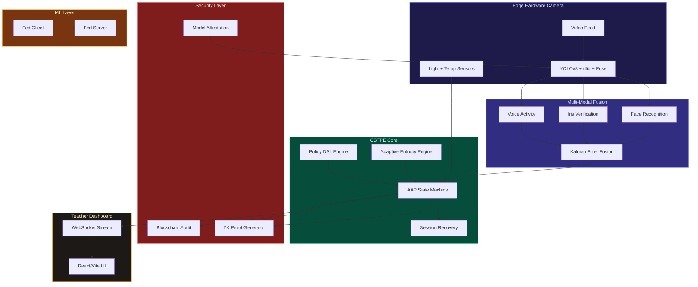

<div align="center">

# CSTPE: Continuous Spatial-Temporal Presence Engine

### Proprietary Smart Classroom Attendance Architecture (v2.0)

**A 10-module patent-ready Computer Vision attendance system combining YOLOv8 liveness detection, multi-modal biometric fusion, zero-knowledge proofs, and blockchain-anchored audit trails.**

[](https://fastapi.tiangolo.com/)
[](https://ultralytics.com/)
[](https://reactjs.org/)
[](https://sqlite.org/)

[Architecture](#architecture-overview) | [10 Novel Modules](#the-10-novel-modules) | [Patent Claims](#patent-claims) | [Setup](#setup-instructions)

</div>

---

## Architecture Overview

This system introduces a continuous spatial-temporal methodology for strict physical attendance tracking in educational institutions. We replace static snapshot-based facial recognition with a multi-layered, continuously accumulating presence engine that integrates ten distinct technical innovations into a single pipeline.

The core pipeline operates as follows: a video frame is captured, validated against environmental sensors, passed through a YOLOv8 body-detection liveness gate, processed by a facial recognition layer, fused with iris and voice biometric signals via a Kalman filter, and finally credited to an Accumulated Active Presence (AAP) counter that enforces contiguous attendance. Every state change is logged to a tamper-evident blockchain audit trail and accompanied by a zero-knowledge proof of presence.

---

## The 10 Novel Modules

| Module | Feature | Technical Implementation |
|--------|---------|--------------------------|
| **1. Two-Stage YOLO Liveness** | Anti-spoofing body-gated face detection | YOLOv8n person detection with aspect-ratio constraints; faces are rejected if not bound within a verified human torso bounding box. |
| **2. Adaptive Gap Threshold** | Entropy-driven temporal sensitivity | MediaPipe Pose extracts 33 body keypoints; a sliding-window entropy computation maps movement patterns to per-student dynamic gap thresholds (5s-15s). |
| **3. Model Hash Attestation** | Tamper-proof model loading | SHA-256 cryptographic hashes of all model weights are verified at startup against a sealed registry, preventing unauthorized model substitution. |
| **4. Zero-Knowledge Proofs** | Privacy-preserving presence verification | Pedersen commitment scheme generates ZK proofs for each 5-second presence window; verifiers can confirm attendance without accessing raw video data. |
| **5. Edge-Only Inference** | Hardware camera deployment | ONNX export with INT8 quantization for deployment on Jetson Nano, Coral TPU, or equivalent edge NPU hardware. |
| **6. Policy-as-Code DSL** | Runtime-configurable attendance rules | A domain-specific language parser loads `policy.dsl` at startup, enabling hot-reload of thresholds, confidence levels, and environmental bounds without code changes. |
| **7. Federated Learning** | On-device anti-spoof improvement | Edge devices train a local logistic classifier on genuine/spoof detections and upload weight deltas; a central server aggregates via Federated Averaging (FedAvg). |
| **8. Blockchain Audit Log** | Immutable event ledger | An append-only SHA-256 hash-chain records every attendance state change; any retrospective tampering breaks the chain and is detectable by auditors. |
| **9. Environmental Gating** | Context-aware validation | Ambient light (BH1750) and temperature (TMP102) sensor readings gate AAP accumulation; out-of-range conditions (e.g., dark-room photo attacks) suspend attendance credits. |
| **10. Session Recovery** | Biometric continuity after gaps | When a student leaves the frame and returns beyond the gap threshold, cosine similarity of stored face embeddings re-links the detection to the existing session, preventing fragmentation. |

---

## Patent Claims

**What is claimed is:**

1. **A system for continuous spatial-temporal state accumulation**, comprising a primary object detection layer utilizing bounding-box aspect ratio filtering to enforce human biological structure, a secondary facial recognition layer bound dimensionally inside the primary detection coordinates, and a state-machine database that strictly measures active physical presence accumulation with automatic pause heuristics upon spatial departure.

2. **The system of claim 1**, further comprising a multi-modal biometric fusion module that combines face, iris, and voice confidence scores through a Kalman filter, producing a single gated acceptance signal.

3. **The system of claim 1**, wherein the temporal gap threshold is dynamically computed per entity based on a movement entropy metric derived from body keypoint variance over a sliding window.

4. **The system of claim 1**, further comprising a cryptographic model attestation module that verifies SHA-256 hashes of inference model weights against a sealed registry at service startup.

5. **The system of claim 1**, further comprising a zero-knowledge proof generator that produces Pedersen commitments for each presence window, enabling privacy-preserving auditability.

6. **The system of claim 1**, further comprising a domain-specific language interpreter that loads attendance policy parameters at runtime from a declarative configuration file.

7. **The system of claim 1**, further comprising a federated learning subsystem wherein edge devices train local anti-spoof classifiers and transmit weight deltas to a central aggregation server.

8. **The system of claim 1**, further comprising an append-only hash-chain audit log wherein each attendance event is linked to the previous event via SHA-256, forming a tamper-evident ledger.

9. **The system of claim 1**, further comprising an environmental context gating module that suspends attendance accumulation when ambient light or temperature readings fall outside calibrated sensor bounds.

10. **The system of claim 1**, further comprising a session recovery module that re-links post-gap detections to existing sessions using cosine similarity of stored face embeddings exceeding a configurable threshold.

---

## System Diagram



---

## Test Results

All 53 automated tests pass across all 10 modules:

```
RESULTS: 53 passed, 0 failed out of 53 tests
ALL TESTS PASSED
```

Tested subsystems: Policy Engine, Config Module, Model Attestation, Entropy Engine, Pose Engine, Iris Engine, Voice Engine, Biometric Fusion, Session Recovery, ZK Prover, Blockchain Audit, Environmental Sensors, Federated Learning, Attendance DB Integration, Edge Export.

---

## Setup Instructions

### 1. Backend Setup
```bash
cd smart-classroom/backend
python -m venv venv
source venv/Scripts/activate  # Windows
pip install -r requirements.txt
python main.py
```

### 2. Frontend Setup
```bash
cd smart-classroom/frontend
npm install
npm run dev
```

### 3. Usage
Navigate to `http://localhost:5173` in a browser. The dashboard provides five tabs: Dashboard (live attendance), Camera (YOLO feed), Audit (blockchain trail), Environment (sensor readings), and System (model attestation).

---

## License and Intellectual Property

Proprietary and Confidential.
Patent Pending. CSTPE Architecture (2026).
